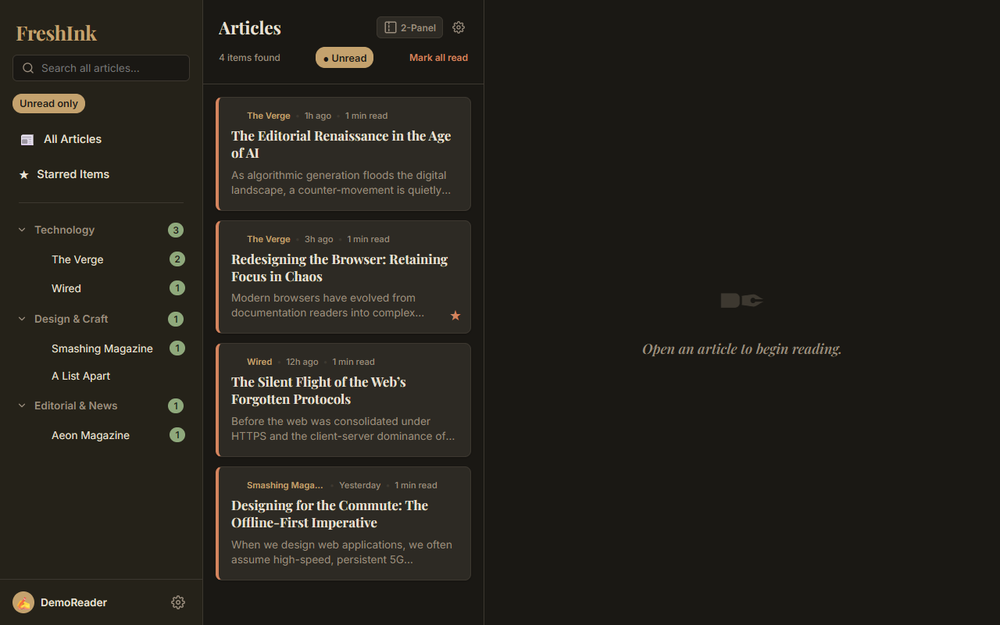
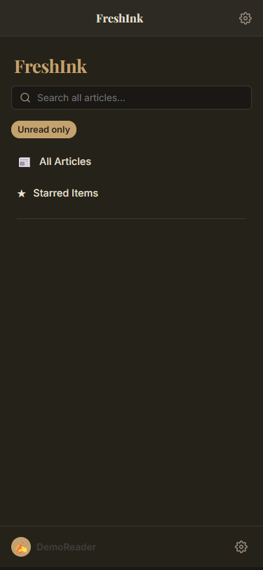

# FreshInk — Premium Editorial FreshRSS Web Reader




A state-of-the-art, mobile-first Progressive Web App (PWA) client for FreshRSS. Built with gorgeous editorial typography, natural organic earth-tone palettes, offline commute syncing, background worker parsing, and custom reading layouts.

**Note: This project was entirely built by AI.**

## 🌟 Features

- **4 Premium Reading Themes**: Parchment (cream), Forest Ink (sage), Midnight Wood (dark), and Nordic Gray (slate).
- **Offline Commute Syncing**: True offline support using IndexedDB. Actions taken offline (starring, marking as read) are queued and synced automatically when you reconnect.
- **Background Article Syncing**: Utilizes Service Workers and the Periodic Background Sync API to silently fetch articles so they are ready before you even open the app.
- **Editorial Typography**: Uses Playfair Display and Source Serif 4. Features a "Gutenberg Mode" toggle to override messy inline feed CSS with a clean, double-spaced stylesheet.
- **Custom Reading Layouts**: Fluid responsive grid. Desktop supports a togglable 3-panel (Sidebar | List | Reader) or 2-panel layout. Mobile uses seamless swipe navigation.
- **Cloudflare Worker Proxy**: Bypasses CORS issues and performs heavy Readability-style HTML scraping and server-side DOM sanitization to keep your client bundle lightweight and safe.
- **Instant Client-Side Search**: Filters your cached articles instantly without network latency.

## 🛠️ Built With

FreshInk was developed using the following technologies:
- **React 19**: Modern frontend framework for UI rendering and state management.
- **Vite**: Blazing fast frontend tooling and bundler.
- **Tailwind CSS**: Utility-first CSS framework for rapid and responsive UI styling.
- **Cloudflare Workers**: Edge computing used to proxy API requests, bypass CORS, and sanitize payloads server-side.
- **IndexedDB & Service Workers (PWA)**: For robust offline capabilities and background data synchronization.

## ⚙️ How It Works

FreshInk is an offline-first PWA. Instead of requesting data from the FreshRSS server every time you click an article, the app relies on a Cloudflare Worker proxy. The proxy fetches your RSS feeds, cleans the HTML payloads, and passes the sanitized data back to the client. The client stores these articles locally in IndexedDB. All interactions (such as reading or starring articles) are executed against the local database instantly and are queued to sync with your actual FreshRSS server in the background once you are online.

## 🚀 Setup Instructions

### Prerequisites
- Node.js (v18+)
- A FreshRSS instance with "Allow API access" enabled and an API password set.
- A Cloudflare account (for deploying the Worker proxy).

### 1. Local Development
Clone the repository and install the required dependencies:
```bash
npm install
```
Start the local Vite development server:
```bash
npm run dev
```
Open `http://localhost:5173` in your browser.

### 2. Cloudflare Worker Deployment
The Cloudflare Worker acts as a secure API proxy and full-text scraper.

1. Navigate to the `worker/` directory:
   ```bash
   cd worker
   ```
2. Install the Wrangler CLI globally if you haven't already:
   ```bash
   npm install -g wrangler
   ```
3. Open `worker/wrangler.toml` and update it with your FreshRSS URL.
4. Deploy the worker to your Cloudflare account:
   ```bash
   wrangler deploy
   ```

### 3. Production Build & Deployment
1. Build the production client bundle:
   ```bash
   npm run build
   ```
2. Deploy the `dist/` directory to any static host (e.g., Cloudflare Pages, Vercel, Netlify).
3. Open the app on your mobile device and tap "Add to Home Screen" to install it as a native PWA for full background sync support.


## 📄 License

This project is licensed under the MIT License - see the [LICENSE](LICENSE) file for details. Copyright (c) 2026 kaniamutan14.
